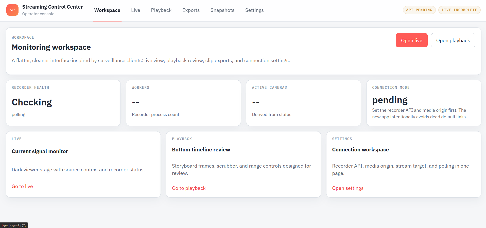
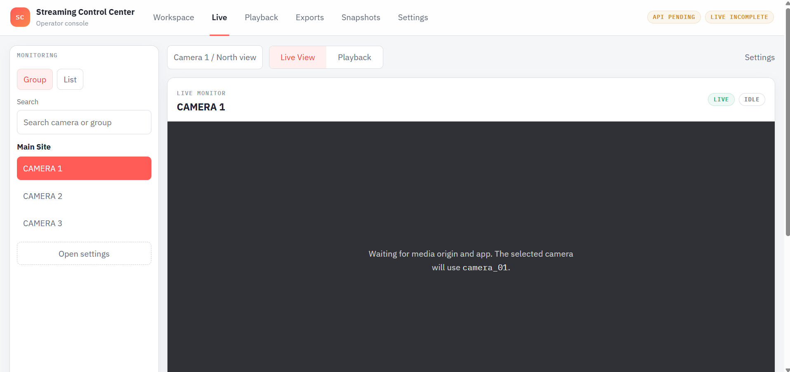
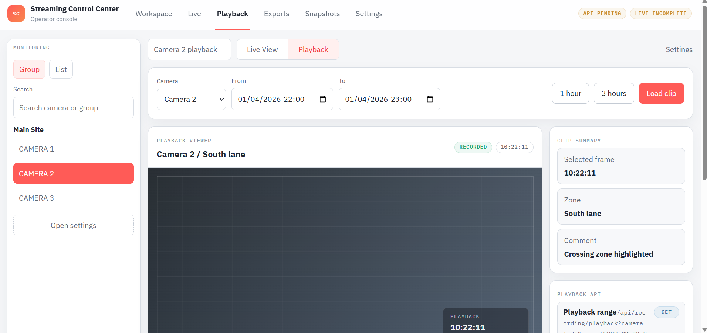
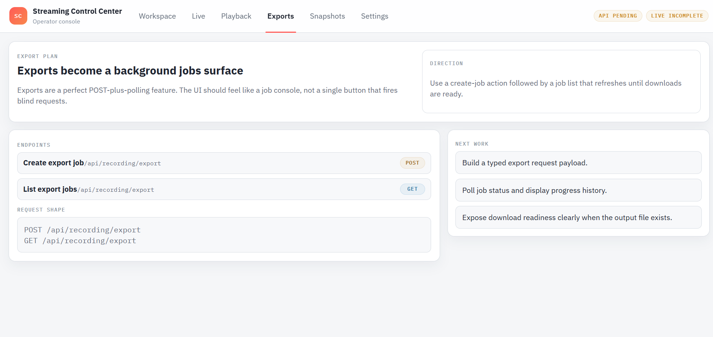
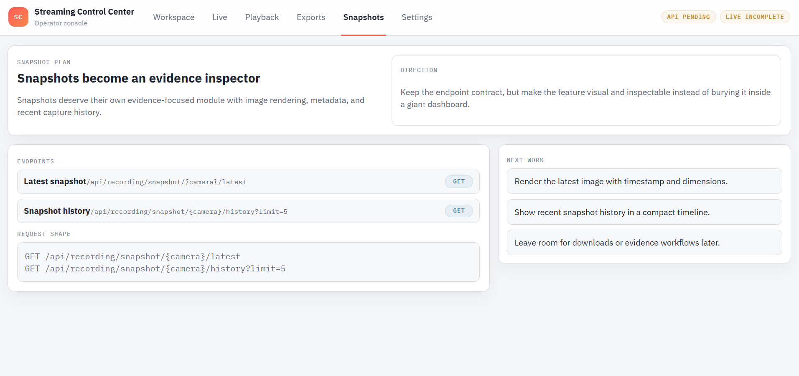
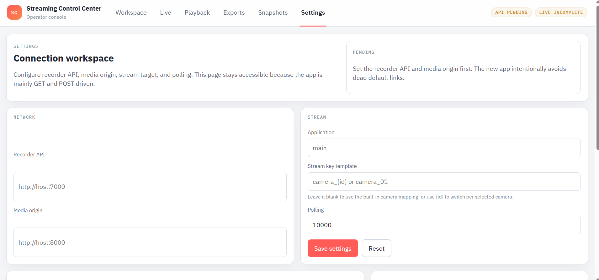

# Streaming Control Center

Standalone web console for live monitoring, playback review, exports, snapshots,
and recorder API operations.

## Screenshots

### Workspace



### Live



### Playback



### Exports



### Snapshots



### Settings



## Current State

This repository now has a React + Vite shell shaped like a monitoring client:
light operator chrome, dark video stages, bottom playback timeline, and a
dedicated settings workspace for recorder endpoints.

The current rebuild already includes:

- browser-persisted local configuration
- shared API helpers for recorder health and status
- React Query polling
- live HLS playback inside the new shell
- endpoint-aware blueprint pages for playback, exports, and snapshots
- a monitoring layout direction inspired by surveillance clients

## First Milestones

- create a clean routed shell for the standalone product
- replace hardcoded defaults with browser-persisted config
- wire shared API calls for health, live, playback, exports, and snapshots

## Development

```bash
npm install
npm run dev
```
