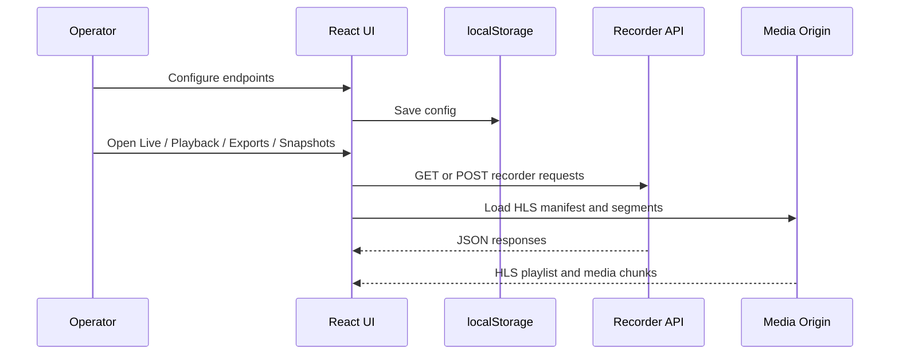

# API Integration

## Current approach

The application talks directly to the recorder stack. No internal backend is
required for the current scope.

## Config values

| Key | Purpose |
| --- | --- |
| `apiBase` | Base URL for recorder REST endpoints |
| `mediaBase` | Base URL for HLS media delivery |
| `app` | Media application path segment |
| `streamKey` | Stream key or template used by live playback |
| `pollingMs` | Polling interval for recorder status queries |

## Endpoint map

| Feature | Method | Path |
| --- | --- | --- |
| Recorder health | `GET` | `/api/recording/health` |
| Recording status | `GET` | `/api/recording/status` |
| Live manifest | `GET` | `/{mediaBase}/{app}/{streamKey}/index.m3u8` |
| Playback range | `GET` | `/api/recording/playback?camera={id}&from={...}&to={...}` |
| Playback availability | `GET` | `/api/recording/playback/available?camera={id}&date={...}` |
| Create export job | `POST` | `/api/recording/export` |
| List export jobs | `GET` | `/api/recording/export` |
| Latest snapshot | `GET` | `/api/recording/snapshot/{camera}/latest` |
| Snapshot history | `GET` | `/api/recording/snapshot/{camera}/history?limit=5` |

## Interaction model

## When to add a backend later

Introduce a backend only if we need one of these:

- authentication and roles
- saved user preferences shared across machines
- camera metadata not available from the recorder API
- audit logs or evidence workflows
- proxying or securing recorder endpoints behind one service
