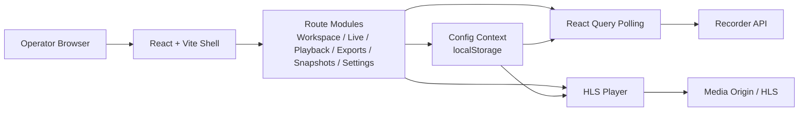
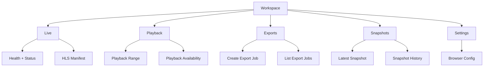

# Architecture

## Goal

`streaming-control-center` is a standalone frontend that consumes recorder and
media endpoints directly. Right now there is no local backend and no local
database layer in the product architecture.

## Runtime view

## Main ideas

- The browser holds configuration in `localStorage`.
- `Settings` defines `apiBase`, `mediaBase`, `app`, `streamKey`, and `pollingMs`.
- `Live`, `Playback`, `Exports`, and `Snapshots` are UI modules over external
  endpoints.
- `React Query` is used for polling and cache management on recorder data.
- `hls.js` is used for live playback when HLS is available.

## Screen responsibility

## Current boundary

- This project is frontend-only today.
- If later we need users, roles, saved layouts, or local metadata, then we can
  add a backend as a separate layer.
- Until that happens, the cleanest architecture is direct `GET` and `POST`
  integration with the existing services.
